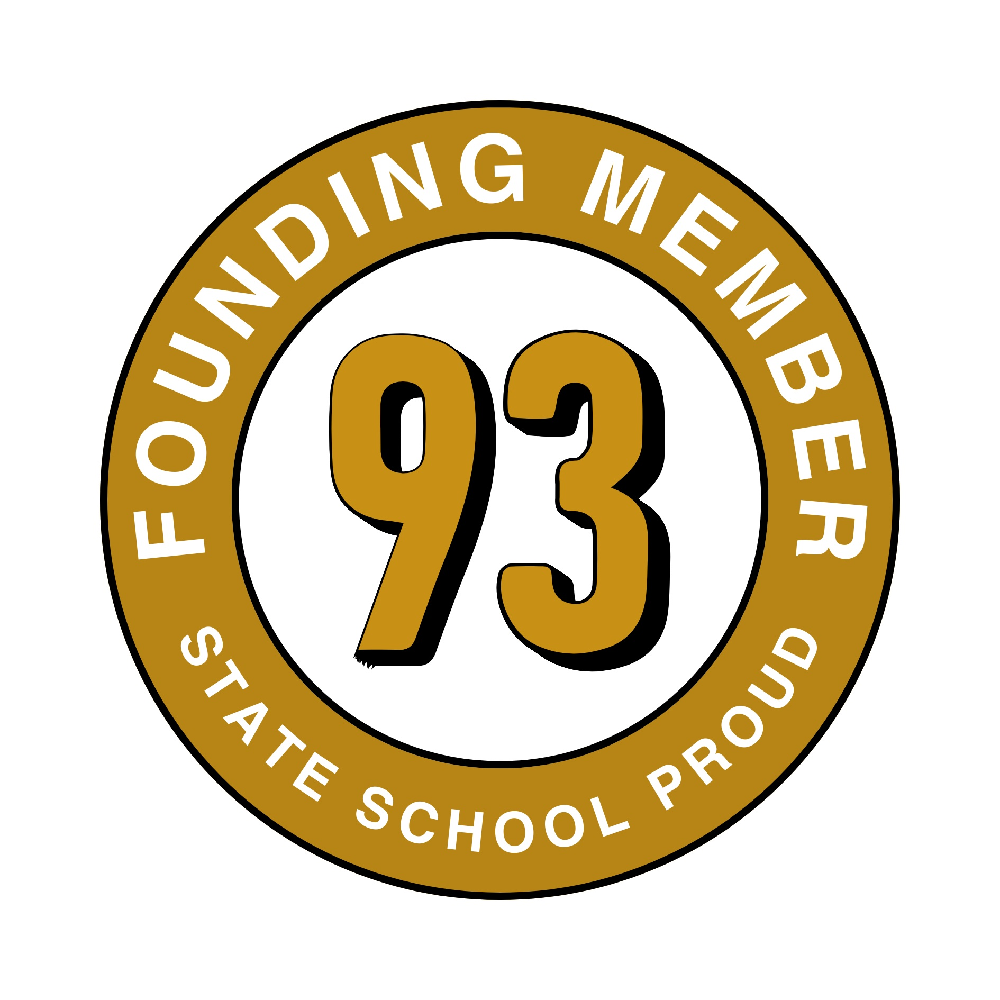

# SO, WHAT SCHOOL DID YOU GO TO? {-}

Have you ever been asked WHAT SCHOOL DID YOU GO TO? I was once asked this in a high-stakes job interview and my answer was that of a startled rabbit caught in the headlights before becoming squashed roadkill on the highway to hell. Nobody has asked me that question before or since. How can such a simple question be so difficult to answer?

```{r badge-fig, echo = FALSE, fig.align = "center", out.width = "99%", fig.cap='(ref:captionbadge)'}

```

(ref:captionbadge) I'm State School Proud and a founding member of the [93percent.club](https://www.93percent.club/)

WHAT SCHOOL DID YOU GO TO? a *big question* that triggered an avalanche of even more confusing questions in my head rather than a composed answer from my mouth:

* Why was the interviewer asking, when my school was listed right at the top of my CV which I could see him reading from across the table? 
* How the hell was the school I attended relevant to my suitability for the role?
* Was this a friendly warm-up question, an innocent icebreaker or a inappropriately tricky tiebreaker to sort the men from the boys (and the women from the girls)?
*  Was the purpose of the interview to enable the Human Resources department to cynically tick some state school box for #Equality, #Diversity & #Inclusion before abandoning me by the roadside as unfortunate (but deliberate) interview roadkill?
* Maybe the interviewer would like to know where they could shove their stupid question?

Years later, I still can't decide what to make of the WHAT SCHOOL DID YOU GO TO interview question. If you were asked this question in a high-stakes job interview what would your answer be?

This is my answer featuring the University of Oxford, the Social Mobility Commission, the Sutton Trust, Martina Milburn, Peter Lampl, Justine Greening, the Independent Schools council, Catrin Nye, Bryan Mathers from Visual Thinkery, The Royal Society, the Royal Family, the gatsby charitable foundation and a club I've recently joined as a founding member, called the 93 percent club.

Thanks to sophie pender, imogen carr, Lorna Culpin, ellie waldrope, viktor polyakov, st laurence school academy trust, nice to meet you sarah mohamed, conor churchman, benjamin hobbs

To my socially responsible #EDI colleagues at the University of Manchester working in Student Access, Participation and Success, come and join us in supporting 93% club students better: sheeree palmer, banji adewumi and julian skyrme, david spendlove, umsu, lexie baynes, katie jackson, UMSU, penney gordon lanes, 

<!--andrew stewart, uli sattler, danielle george, penney gordon lanes, paul nutter, kelly anne holmes, lexie baynes and duncan ivison-->

This is mine.

## Beware of the heavily loaded juggernaut! {-}

The heavily loaded question of WHAT SCHOOL DID YOU GO TO is a very personal, political and provocative one. It proved to be a fatal one in a [Gatsby Scholarship](https://www.gatsby.org.uk/) interview for a PhD at the University of Oxford because I wasn't expecting the question or the snarky reply to my bewildered answer. As with many job interviews, there was a big power imbalance between the interviewer and the interviewee. The Professor interviewing me was a member of some very exclusive  mostly [gentlemens clubs](https://en.wikipedia.org/wiki/Gentlemen%27s_club) in London with a paltry `12%` female membership. [@royaldiversity] One of these clubs was the UK's National Academy of Sciences, the [royalsociety.org](https://royalsociety.org/) whose members, or [Fellows (as they like to be called)](https://en.wikipedia.org/wiki/Fellow_of_the_Royal_Society), get to use the prestigious letters `FRS` after their name. The other club was the [Commander of the British Empire](https://www.thegazette.co.uk/awards-and-accreditation/content/103372) club, aka  `CBE`, appointed by the royal family. Let's call this exclusive invite-only club the imperial club.

```{r rabbit-fig, echo = FALSE, fig.align = "center", out.width = "99%", fig.cap='(ref:captionrabbit)'}
knitr::include_graphics("images/Rabbit-in-the-headlights.jpg")
```
(ref:captionrabbit) Just before becoming interview roadkill, I froze like a breathless rabbit caught in the headlights of the question many state schoolers dread: WHAT SCHOOL DID YOU GO TO? [@varsity] This interview wasn't looking like the _Stairway to Heaven_ I'd hoped for, [@stairway] but more of a _Highway to Hell_. [@highwaytohell] Rabbit sketch by [Visual Thinkery](https://visualthinkery.com/) is licensed under [CC-BY-ND](https://creativecommons.org/licenses/by-nd/4.0/) 🐰

The odds are about `5:1` that this Professor was also a member of the `7%` club [@mostpowerful], that's the elite minority group of the UK population who are [privately educated](https://www.isc.co.uk) by one of the UK's formidable [Engines of Privilege](https://en.wikipedia.org/wiki/Engines_of_Privilege). [@nicebutdim] But who knows [@whoswho]? This Professor was justifiably proud to be a Fellow the Royal Society and a member of the imperial club, because they are both `0.001%` clubs. Only 0.01% of the UK population are deemed worthy to get on the guest list. [@jollygoodfellows] Membership of those London clubs doesn't come easily because the bouncers working the doors are notoriously picky and opinionated. If your name isn't down, you're not coming in. The Professor was up there in career clubbers heaven with other Gods, who also had lots of titles and letters after their names too. 

## Stairway to Heaven or Highway to Hell? {-}

In stark contrast to my interviewer, the only letters I had after my name were the humble `BSc` ([Hons](https://en.wikipedia.org/wiki/Honours_degree)). On being asked WHAT SCHOOL DID YOU GO TO, these letters were rapidly followed by a collection of other post-nominals including `WTF`? `OMG` and `FFS`! The only relevant club I was a member of was the inclusive `93%` club, a group for the overwhelming majority of the UK population educated in state schools. The club didn't actually exist back then but I'm glad it exists now. 

While I ended up as yet more [roadkill](https://en.wikipedia.org/wiki/Roadkill) on the interview [highway to hell](https://en.wikipedia.org/wiki/Highway_to_Hell_(song)), just another casualty of the [Oxford juggernaut](https://www.oxfordreference.com/display/10.1093/oi/authority.20110803100026561), I learned a painful, humiliating but important lesson about the importance of pride, or what `93%` clubbers call State School Pride. [@93bbc] My mum, a wise and [stoic](https://en.wikipedia.org/wiki/Stoicism) woman whom I love dearly, warned me about pride. She told me that [pride comes before a fall](https://dictionary.cambridge.org/dictionary/english/pride-comes-goes-before-a-fall). This is often true, except in this case, the alternatives to State School Pride are:

* 📛 State School Shame
* 📛 State School Indifference
* 📛 State School [Impostor syndrome](https://en.wikipedia.org/wiki/Impostor_syndrome) 
* 📛 State School [Inferiority complex](https://en.wikipedia.org/wiki/Inferiority_complex)
* 📛 Private School [Superiority complex](https://en.wikipedia.org/wiki/Superiority_complex)

I've worn all those badges, apart from the private school one. They don't feel comfortable, they don't look good and they don't help you get the most out of life. If you're a state schooler, I don't recommend wearing them unless you want to become roadkill. Go for the pride badge!

Whatever school badge you decide to wear, your education is a paradox. It's both _incredibly relevant_ and _completely irrelevant_ on your CV and in job interviews. My state schooling, funded by the taxpayer, was relevant because I'd been invited to interview thanks to years of hard work by my teachers. If it wasn't for the teachers who patiently taught me (and my friends and family) during thirteen years of primary and secondary school education I wouldn't have been able to express myself to create a CV accompanied by a persuasive covering letter that convinced decision makers to interview me. If it wasn't for my maths and science teachers, I would never have gone to University in the first place. 

But at the same time, that very same education was completely irrelevant, it should not affect how I was treated. Should it have even been an interview question at all? 

On the upside, an open-ended question like this invites the interviewee to challenge the authority of the interviewer. On the downside the irrelevance of the question will probably make HR department veto it because it doesn't comply with their EDI policy. 

The school anybody went to shouldn't be a factor in either being invited to interview or being made a job offer. With help from Viktor Polyakov and Ellie Wardrope, I recorded a video testimonial to that effect last month at the Founding Member's Reception in Manchester of the 93percent.club. 

Thanks to [Sophie Pender](https://en.wikipedia.org/wiki/Sophie_Pender), [Imogen Carr](https://www.93percent.club/team) and [Lorna Culpin](https://www.linkedin.com/in/lorna-culpin-a5787879) for inviting me to and hosting the reception at [ey.com](https://www.ey.com). I had a blast, it was good to speak to you [Conor Churchman](https://www.ada.ac.uk/page/?title=People&pid=63&people=259) from [ada.ac.uk](https://www.ada.ac.uk/), the National College for Digital Skills, [Sarah Mohammed Qureshi](https://www.law.ac.uk/resources/blog/diversity-matters-sarah-mohammad-qureshi/) from the [University of Law](https://www.law.ac.uk) and [Benjamin Hobbs](https://uk.linkedin.com/in/benjamindhobbs) from the [Greater Manchester Combined Authority](https://www.greatermanchester-ca.gov.uk/). I'm looking forward seeing you again and meeting more kindred spirits at future events online and in person.

## Answer The Friendly Question (ATFQ) {-}
So I need to do what all teachers tell their students to do: [Answer The Friendly Question](https://en.wikipedia.org/wiki/ATFQ) `ATFQ` after carefully reading and re-[Reading The Friendly Question](https://en.wikipedia.org/wiki/RTFM) `RTFQ` & `RRTFQ`... 

SO, WHAT SCHOOL DID YOU GO TO? It's not really any of my business and shouldn't affect how you are treated. There's an argument for making whatever kind of education you've had another [protected characteristic](https://www.gov.uk/discrimination-your-rights). [@amolceiling] Just as your age, your race, your religion or beliefs, your sexual orientation, your gender, your disabilities, your marriage or civil partnership, your pregnancy and maternity, your education shouldn't determine how you are treated either. These characteristics are covered by the [Equality Act of 2010](https://www.legislation.gov.uk/ukpga/2010/15/contents). Your education (private or state) is your business, and you probably didn't have that much say in which school you went to anyway.

```{r ninetytree-fig, echo = FALSE, fig.show = "hold", out.width = "14%", fig.cap = "(ref:caption93)"}
knitr::include_graphics(rep("images/ninetythree.jpg", 7))
```

(ref:caption93) Anyone can become an owner of an awesome 93% club enamel pin badge by joining us at [93percent.club/join](https://www.93percent.club/join) 📛

What I definitely care about `100%`, is the school I went to, especially when someone asks me in a high-stakes job interview then mocks my reply. I'm lucky to have attended the kind of state schools that never held me back and got me to wherever I wanted to go. Thank you [Fitzmaurice Primary School](https://www.fitzmauriceschool.info/) and [St. Laurence School](https://www.st-laurence.com/). Thanks to my amazing school teachers and thousands more professionals just like them working hard in an [increasingly challenging state sector](https://www.theguardian.com/commentisfree/2024/sep/19/the-guardian-view-on-the-teacher-shortage-flexibility-and-career-breaks-could-help) to educate *everyone* in the UK: 

* regardless of their ability to win scholarships
* regardless of their socio-economic background
* regardless of their ability to pass an extrance exam 
* regardless of their families ability to pay the school fees, with or without VAT [@pannick]
* regardless of their ability to live in the catchment area of the “right” school

That's [millions of students in state schools across the UK](https://explore-education-statistics.service.gov.uk/find-statistics/school-pupils-and-their-characteristics). I'm proud to be a card-carrying, badge-wearing, word-spreading and founding member of the UK's _least_ exclusive members club: the [93percent.club](https://www.93percent.club/). 💪

## Join us in tackling inequality across the UK {-}

Not everyone educated in the state sector is as fortunate. [@amolceiling] As the Education secretary [Justine Greening](https://en.wikipedia.org/wiki/Justine_Greening) once put it, talent is spread evenly but opportunity is not. [@greening] There is a [class ceiling](https://policy.bristoluniversitypress.co.uk/trade/the-class-ceiling) which prevents many students educated in the state sector from getting the opportunities they need and deserve. [@classceiling] That's just plain wrong. Unfortunately, the UK is still a country where the school you went to _definitely_ counts, and the higher you go in any profession, the more it tends to matter. Your education has a huge influence on how society treats you and the educational system in the UK is riddled with inequality from the bottom to the top. The [Elitist Britain](https://www.suttontrust.com/our-research/elitist-britain-2019/) report by [Martina Milburn](https://en.wikipedia.org/wiki/Martina_Milburn) and [Peter Lampl](https://en.wikipedia.org/wiki/Peter_Lampl) at the Social Mobility Commission and Sutton Trust provides an unappetising taster of the scale of the problem. [@elitistbritain]

Would you like to help us tackle inequality through the power of community? Would you like empower state-educated students by giving them access to more social capital, better opportunities, improved careers advice and more mentoring? By bringing together thousands of like-minded individuals across the country, we are breaking down the structural barriers to social mobility and building a future that’s fairer for the next generation. Find out how to join at [93percent.club/join](https://www.93percent.club/join)

If you're a student studying in the UK, your University may also have a local chapter you can also join such as the one at [manchesterstudentsunion.com/activities/view/93club](https://manchesterstudentsunion.com/activities/view/93club)

P.S. Sophie, speaking of word-spreading, when is the next episode of the [WHAT SCHOOL DID YOU GO TO](https://open.spotify.com/show/3e8K1fcNbqck9k9pFIGlG8) podcast due? It's been a while... [@whatschooldidyougoto]


## References {-}


```{r rock-vid, echo = FALSE, fig.align = "center", out.width = "99%", fig.cap = "(ref:captionrock)"}
knitr::include_url('https://www.youtube.com/embed/l482T0yNkeo')
```

(ref:captionrock) So tell me girls and boys, WHAT SCHOOL DID YOU GO TO? “We went to the [School of Rock](https://en.wikipedia.org/wiki/School_of_Rock) [@schoolofrock]. Yeah Baby! It's on the [Highway to Hell](https://en.wikipedia.org/wiki/Highway_to_Hell_(song)) [@highwaytohell] because [It's a Long Way to the Top (If You Went to a State School](https://en.wikipedia.org/wiki/It%27s_a_Long_Way_to_the_Top_(If_You_Wanna_Rock_%27n%27_Roll))) [@longway]” 🎸


